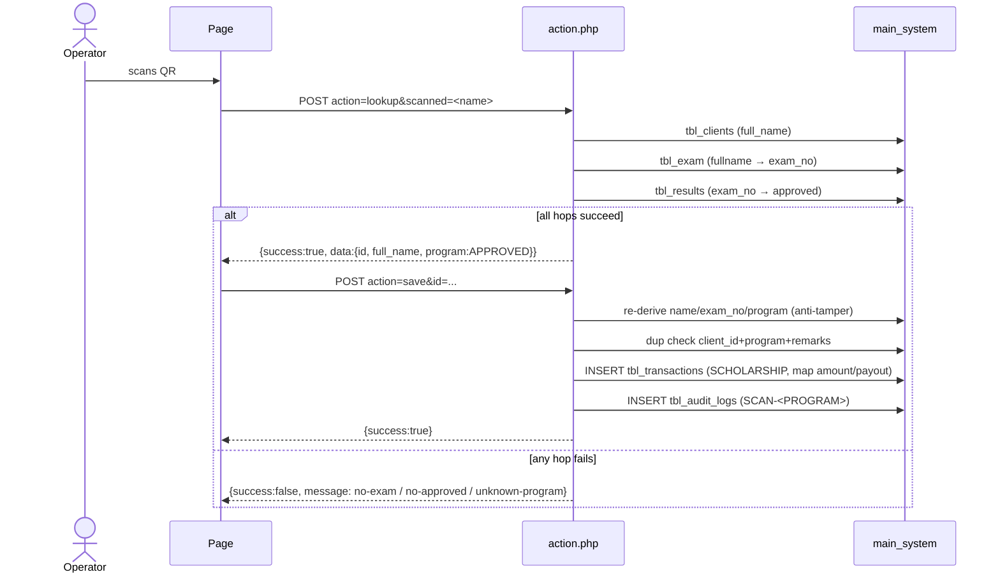
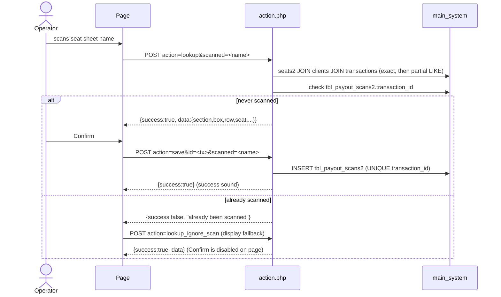
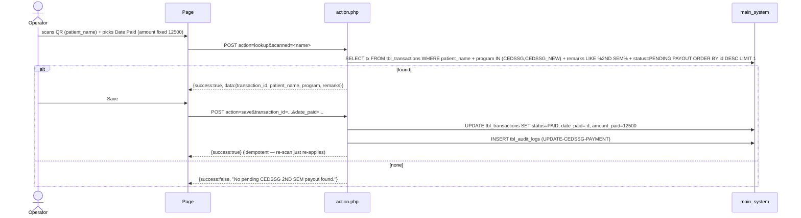
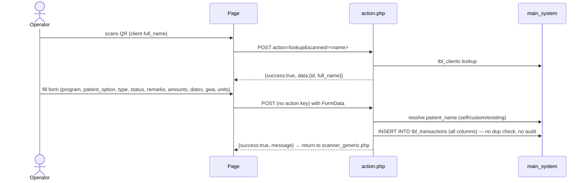

# Scanner Engine Analysis — v1 (P4)

Status: **Analysis only.** No Laravel code was written. This document is the
read-only study of every v1 scanner implementation in `C:\xampp\htdocs\system`
before the P4 `ScanService` is built.

Scope: the 14 scanner pages + 15 action handlers listed in §2, plus the shared
helpers they depend on (`session.php`, `db_connect.php`, `restriction.php`,
`logs.php`). All business behavior is to be preserved **byte-for-byte**; no
workflow redesign; no schema change.

---

## 1. Method

Every `scanner_*` page and `scanner_*_action.php` file was read in full. For
each scanner we recorded: purpose, input, output, transaction flow, duplicate
rules, validation rules, remarks/program values, attendance behavior, update
behavior, special cases, tables touched, and which logic is reusable vs.
scanner-specific. Results are in §4. The 15 v1 page gate names (`restriction.php`
`page_name`) are the exact strings that the v2 ACL page rows must reproduce.

---

## 2. Scanner inventory

| # | Scanner | Page file | Action file | v1 `page_name` gate |
|---|---------|-----------|-------------|---------------------|
| 1 | CEAP 1st-sem docs | `scanner_ceap.php` | `scanner_ceap_action.php` | `scanner_ceap.php` |
| 2 | CEAP_NEW 1st-sem docs | `scanner_ceap_new.php` | `scanner_ceap_new_action.php` | `scanner_ceap_new.php` |
| 3 | CEDSSG 1st-sem docs | `scanner_cedssg.php` | `scanner_cedssg_action.php` | `scanner_cedssg.php` |
| 4 | CEDSSG_NEW 1st-sem docs | `scanner_cedssg_new.php` | `scanner_cedssg_new_action.php` | `scanner_cedssg_new.php` |
| 5 | CEDSSG 2nd-sem payment update | `scanner_cedssg_update.php` | `scanner_cedssg_update_action.php` | `scanner_cedssg_update.php` |
| 6 | OTCES SY docs | `scanner_otces.php` | `scanner_otces_action.php` | `scanner_otces.php` |
| 7 | OTEA SY docs | `scanner_otea.php` | `scanner_otea_action.php` | `scanner_otea.php` |
| 8 | TODA cash relief | `scanner_toda.php` | `scanner_toda_action.php` | `scanner_toda.php` |
| 9 | TUPAD cash-for-work | `scanner_tupad.php` | `scanner_tupad_action.php` | `scanner_tupad.php` |
| 10 | Generic transaction form | `scanner_generic.php` | `scanner_generic_action.php` | **none — no `restriction.php` include (v1 gap)** |
| 11 | New scholars (exam-derived program) | `scanner_new_scholars.php` | `scanner_new_scholars_action.php` | `scanner_new_scholars.php` |
| 12 | Ongoing scholars (validate-existing) | `scanner_ongoing_scholars.php` | `scanner_ongoing_scholars_action.php` | `scanner_ongoing_scholars.php` |
| 13 | Payout attendance (seat-aware) | `scanner_payout.php` | `scanner_payout_action.php` | `scanner_payout.php` |
| 14 | Unpaid payout attendance | `scanner_payout_unpaid.php` | `scanner_payout_unpaid_action.php` | `scanner_payout_unpaid.php` |

14 scanners, 15 action files (payout has 3 actions: `lookup`, `save`,
`lookup_ignore_scan`).

---

## 3. Shared scaffolding and helpers

| Helper | Role | Scanner relevance |
|--------|------|-------------------|
| `session.php` | Starts session; single-device `session_token` check vs `tbl_users`; updates `last_activity`; reads `tbl_multi_device_exemptions` | All pages + actions depend on it. Enforces login (redirects to `login.php?session=expired` on token mismatch). No page permission check here. |
| `db_connect.php` | PDO to `main_system` (root/empty password, local) | Included by everything (also via `session.php`). |
| `restriction.php` | Page ACL: loads `tbl_permissions.can_access` for `page_name = basename(PHP_SELF)`; blocks with alert + redirect to `index.php`. Bypasses for `user_id == 1` and hard-coded usernames `super_admin`, `god_admin`, `jordi` | Included by **every scanner page except `scanner_generic.php`**. Action files never include it. In v2 this whole mechanism is the single `AccessControlService` (ADR-003); page names must match v1 strings. |
| `logs.php` | `log_action($pdo, $user_id, $action, $target_table, $target_id, $old_value, $new_value)` → inserts `tbl_audit_logs` | Used by the transaction-creating scanners (CEAP family, OTEA/OTCES, TODA, TUPAD, new_scholars) and by `cedssg_update`. **Not** used by generic, ongoing, payout, payout_unpaid. |

Common page behavior (all 14 pages): `html5-qrcode` camera (`Html5QrcodeScanner`,
fps 10, 250×250 box), `onScanSuccess` → POST `action=lookup&scanned=<qr>` →
on success show client/transaction details → `Save Transaction` button POSTs
`action=save` → Bootstrap modal + success/error sound (`sounds/success.mp3`,
`sounds/not_found.mp3`). Variations per scanner are noted in §4.

Common action behavior: `Content-Type: application/json`, POST-only, `$action =
$_POST['action'] ?? ''`, `lookup` / `save` branches, `{"success": bool, "message":…,
"data":…}` envelope.

---

## 4. Per-scanner workflow

### 4.1 CEAP — `scanner_ceap` (+ action)

- **Purpose:** Record a 1st-semester CEAP scholarship "docs submitted" transaction.
- **Input:** scanned QR text (= client `full_name`).
- **Output:** new `tbl_transactions` row; audit `SCAN-CEAP`.
- **Flow:** lookup client by `TRIM(full_name) COLLATE utf8mb4_general_ci = :scanned`
  → save inserts transaction.
- **Duplicate rule:** fixed remark key —
  `client_id + program='CEAP' + remarks='1ST SEM SY2025-2026 DOCS SUBMITTED'`
  (app-level `COUNT(*)`, no DB constraint). Message: "Transaction already recorded for this client."
- **Validation:** client must exist; `client_id > 0`.
- **Transaction values:** `program=CEAP`, `date_applied=CURDATE()`,
  `type=SCHOLARSHIP`, `remarks='1ST SEM SY2025-2026 DOCS SUBMITTED'`,
  `suggested_amount=5000`, `status=PENDING PAYOUT`. **No `payout_date` column.**
- **Attendance:** none.
- **Update behavior:** none (insert only).
- **Special cases:** case-insensitive trimmed name match; page reload after modal OK.
- **Tables:** read `tbl_clients`, write `tbl_transactions`, `tbl_audit_logs`.
- **Reusable:** client lookup, insert-scholarship-template, remark-key duplicate, audit.
- **Scanner-specific:** the constant values above.

### 4.2 CEAP_NEW — `scanner_ceap_new` (+ action)

Identical to 4.1 with these deltas:
- `program='CEAP_NEW'`; audit `SCAN-CEAP_NEW`.
- **Adds `payout_date='2025-08-18'`** to the insert.
- Duplicate remarks key same string (`'1ST SEM SY2025-2026 DOCS SUBMITTED'`).

### 4.3 CEDSSG — `scanner_cedssg` (+ action)

Same shape as 4.1 with deltas:
- `program='CEDSSG'`; audit `SCAN-CEDSSG`; `suggested_amount=10000`.
- **No `payout_date` column.**

### 4.4 CEDSSG_NEW — `scanner_cedssg_new` (+ action)

Same shape as 4.1 with deltas:
- `program='CEDSSG_NEW'`; audit `SCAN-CEDSSG_NEW`; `suggested_amount=10000`;
  **`payout_date='2025-08-18'`**.

### 4.5 CEDSSG 2nd-sem payment update — `scanner_cedssg_update` (+ action)

- **Purpose:** Mark a pending CEDSSG/CEDSSG_NEW 2nd-sem transaction as PAID
  (payout confirmation), with a user-entered `date_paid`.
- **Input:** scanned text + `date_paid` (front-end date picker; **required**).
  `Amount Paid` shown as a readonly `12500` field on the page.
- **Output:** `UPDATE tbl_transactions SET status='PAID', date_paid=:date_paid,
  amount_paid=12500`; audit `UPDATE-CEDSSG-PAYMENT`.
- **Lookup:** not by client — by transaction:
  `patient_name = :scanned AND program IN ('CEDSSG','CEDSSG_NEW') AND remarks LIKE '%2ND SEM%' AND status='PENDING PAYOUT' ORDER BY id DESC LIMIT 1`.
  Message on miss: "No pending CEDSSG 2ND SEM payout found."
- **Duplicate rule:** none — the UPDATE is idempotent; re-scanning simply re-applies.
- **Validation:** `date_paid` required (client-side), `transaction_id > 0`.
- **Attendance:** none.
- **Update behavior:** this is the only in-place update scanner.
- **Special cases:** hard-coded `amount_paid=12500` (note: the *suggested* 2nd-sem
  amount used by `ongoing_scholars` is 11600 — different number, preserved).
  Page resumes scanning after OK (no reload).
- **Tables:** read/write `tbl_transactions`, write `tbl_audit_logs`.

### 4.6 OTCES — `scanner_otces` (+ action)

Same shape as 4.1 with deltas:
- `program='OTCES'`; audit `SCAN-OTCES`; `suggested_amount=3000`;
  `remarks='SCHOOL YEAR 2025-2026'`; **`payout_date='2025-08-25'`**.

### 4.7 OTEA — `scanner_otea` (+ action)

Same shape as 4.1 with deltas:
- `program='OTEA'`; audit `SCAN-OTEA`; `suggested_amount=5000`;
  `remarks='SCHOOL YEAR 2025-2026'`; **`payout_date='2025-08-18'`**.

### 4.8 TODA — `scanner_toda` (+ action)

- **Purpose:** Record a TODA cash-relief-assistance payout on a chosen date.
- **Input:** scanned text + `date_applied`, `date_paid`, `amount_paid`
  (three page inputs, all required client-side).
- **Output:** new `tbl_transactions` row (status **PAID**); audit `SCAN-TODA`.
- **Lookup:** client by `TRIM(full_name) = :name` (no explicit COLLATE; table
  collation is `utf8mb4_general_ci`), then resolve municipality name from
  `tbl_municipalities` and barangay name from `tbl_barangays` for display.
- **Duplicate rule:** date guard —
  `client_id + program='TODA' + date_applied=:date` (app-level).
  Returns `alreadySaved:true` flag → modal titled "Already Saved".
- **Validation:** client exists; `date_applied`/`date_paid`/`amount_paid` all present.
  `date_applied` falls back to today; `date_paid` to `null` server-side.
- **Transaction values:** `program=TODA`, `type='CASH RELIEF ASSISTANCE'`,
  `remarks=''`, `suggested_amount=0`, `status=PAID`, `amount_paid=<input>`.
- **Attendance:** none.
- **Update behavior:** none.
- **Special cases:** municipality + barangay display names; page resumes scanning after OK.
- **Tables:** read `tbl_clients`, `tbl_municipalities`, `tbl_barangays`; write
  `tbl_transactions`, `tbl_audit_logs`.

### 4.9 TUPAD — `scanner_tupad` (+ action)

- **Purpose:** Record a TUPAD cash-for-work payout.
- **Input:** scanned text + optional `date_applied`/`date_paid` (persisted to
  `localStorage` on the page; both may be blank → server defaults).
- **Output:** new `tbl_transactions` row (status **PAID**); audit `SCAN-TUPAD`.
- **Lookup:** client by `TRIM(full_name) COLLATE utf8mb4_general_ci = :scanned`
  + municipality name via `LEFT JOIN tbl_municipalities`.
- **Duplicate rule:** date guard —
  `client_id + program='TUPAD' + date_applied=:date_applied` (app-level).
  On hit, returns `alreadySaved:true` **plus the existing row** (`id, date_applied,
  date_paid, status, remarks, suggested_amount`) so the page can show details.
- **Validation:** client exists; `client_id > 0`.
- **Transaction values:** `program=TUPAD`, `type='CASH FOR WORK'`,
  `remarks='TUPAD LGBTQIA+'`, `suggested_amount=0`, `status=PAID`,
  `amount_paid=4680.00` (hard-coded).
- **Audit quirk (preserve):** the audit `new_value.remarks` is
  `"TUPAD REGISTRATION 2025"`, which **differs** from the stored `remarks`
  `"TUPAD LGBTQIA+"`.
- **Attendance:** none.
- **Update behavior:** none.
- **Special cases:** `date_applied` empty → `date("Y-m-d")`; `date_paid` empty →
  `null`; modal OK resumes scanning without reload; warning sound on duplicate.
- **Tables:** read `tbl_clients`, `tbl_municipalities`; write `tbl_transactions`, `tbl_audit_logs`.

### 4.10 Generic form — `scanner_generic` (+ action)

- **Purpose:** Free-form transaction entry after a QR lookup; program and all
  fields chosen in the form.
- **Input:** scanned text; then a full form: `program` (AICS, AKAP, MAIP, TUPAD,
  CEDSSG, CEAP), `patient_option` (self / custom / existing-client),
  `date_applied`, `type` (CRA, OCA, CASH FOR WORK, MEDICAL, BURIAL, FOOD SUBSIDY,
  SCHOLARSHIP), `status` (PENDING PAYOUT, PAID), `remarks`, `comments`,
  `suggested_amount`, `amount_paid`, `payout_date`, `date_paid`, `gwa`, `units`.
- **Output:** new `tbl_transactions` row using **all** provided columns.
- **Lookup:** client by `TRIM(full_name) COLLATE utf8mb4_general_ci = :scanned`.
- **Duplicate rule:** **none.** No pre-check, no DB constraint.
- **Validation:** `client_id > 0`; `patient_name` must resolve (self = client
  `full_name`, custom = typed name, existing = another client's `full_name`).
- **Transaction values:** all from the form; empty numerics coerced to `null`.
- **Attendance:** none. **Update behavior:** none.
- **Special cases:** the only scanner where `patient_name` can differ from the
  scanned client (beneficiary options). No `restriction.php` — any logged-in user
  can open it (v1 gap to fix via ACL page gate in v2, e.g. same `scanner_generic.php`
  row). No audit log. Success modal returns to `scanner_generic.php`.
- **Tables:** read `tbl_clients`; write `tbl_transactions`.

### 4.11 New scholars (exam-derived) — `scanner_new_scholars` (+ action)

- **Purpose:** After a scholarship exam, record the approved scholar's 1st-sem
  docs-submitted transaction; **program is derived from exam results**, not the page.
- **Input:** scanned text (client `full_name`).
- **Output:** new `tbl_transactions` row + audit `SCAN-<PROGRAM>`.
- **Lookup chain (3 hops):**
  1. `tbl_clients` by `full_name` (CI/trimmed);
  2. `tbl_exam` by `fullname` → `exam_no`;
  3. `tbl_results` by `exam_no` → `approved` → `strtoupper(trim())` = program.
  Errors: "Client not found", "No exam record found…", "No approved scholarship found…".
- **Save:** **re-derives** client name, `exam_no`, and program server-side
  (anti-tamper), then applies the config map:
  - `CEAP_NEW` → remarks `1ST SEM SY2025-2026 DOCS SUBMITTED`, amount 5000, payout `2025-08-18`
  - `OTEA` → remarks `SCHOOL YEAR 2025-2026`, amount 5000, payout `2025-08-18`
  - `OTCES` → remarks `SCHOOL YEAR 2025-2026`, amount 3000, payout `2025-08-25`
  - `CEDSSG_NEW` → remarks `1ST SEM SY2025-2026 DOCS SUBMITTED`, amount 10000, payout `2025-08-18`
  Any other `approved` value → "Unknown program" rejection.
- **Duplicate rule:** fixed remark key — `client_id + program + remarks` (app-level).
- **Transaction values:** `date_applied=CURDATE()`, `type=SCHOLARSHIP`,
  `status=PENDING PAYOUT`, `payout_date` from map.
- **Attendance:** none. **Update behavior:** none.
- **Special cases:** program shown on the page; success message names the program.
- **Tables:** read `tbl_clients`, `tbl_exam`, `tbl_results`; write `tbl_transactions`, `tbl_audit_logs`.

### 4.12 Ongoing scholars (validate-existing) — `scanner_ongoing_scholars` (+ action)

- **Purpose:** Record a 2nd-semester continuation for an existing scholar;
  **program is derived from the latest transaction**, not the page.
- **Input:** scanned text (client `full_name`).
- **Output:** new `tbl_transactions` row. **No audit log.**
- **Lookup chain:**
  1. `tbl_clients` by `full_name` (CI/trimmed);
  2. latest `program` from `tbl_transactions`
     `WHERE client_id AND program IN ('CEAP','CEDSSG','CEAP_NEW','CEDSSG_NEW')
     ORDER BY id DESC LIMIT 1`.
  Errors: "Client not found", "No ongoing scholarship program found".
- **Save:** re-derives name + program server-side, then config map:
  - `CEAP` / `CEAP_NEW` → remarks `2ND SEM SY 2025-2026 DOCS SUBMITTED`, amount 5000
  - `CEDSSG` / `CEDSSG_NEW` → remarks `2ND SEM SY 2025-2026 DOCS SUBMITTED`, amount 11600
  **No `payout_date`.**
- **Duplicate rule:** fixed remark key **+ patient_name equality** —
  `client_id + program + remarks + patient_name` (app-level). Message: "Transaction already recorded".
- **Transaction values:** `date_applied=CURDATE()`, `type=SCHOLARSHIP`, `status=PENDING PAYOUT`.
- **Attendance:** none. **Update behavior:** none.
- **Special cases:** success scan plays **no sound**; sounds only on failure and
  on save result. Action returns JSON `"Unauthorized"` if not logged in.
- **Tables:** read `tbl_clients`, `tbl_transactions`; write `tbl_transactions`.

### 4.13 Payout attendance (seat-aware) — `scanner_payout` (+ action)

- **Purpose:** Confirm physical payout attendance; **one scan per transaction**
  recorded in `tbl_payout_scans2`. Displays seat assignment (section/box/row/seat).
- **Input:** scanned text = name printed on seat sheet.
- **Output:** row in `tbl_payout_scans2` (`transaction_id`, `scanned_text`,
  `scanned_by`). **No audit log** (the scan row is the record).
- **Lookup (3 actions):**
  - `lookup`: `tbl_seats2 s INNER JOIN tbl_clients c ON LOWER(TRIM(s.name)) =
    LOWER(TRIM(c.full_name)) INNER JOIN tbl_transactions t ON t.client_id = c.id`
    where `LOWER(TRIM(s.name)) = LOWER(:scanned)` and
    `t.program IN ('CEAP','CEDSSG','CEAP_NEW','CEDSSG_NEW','OTEA','OTCES')`,
    `ORDER BY t.id DESC LIMIT 1`. If no exact match, retries with a partial
    `LIKE '%...%'` match. Then checks `tbl_payout_scans2.transaction_id`; if
    present → `"This QR code has already been scanned."`.
  - `lookup_ignore_scan`: re-lookup **by transaction** (`patient_name = :scanned`,
    LEFT JOIN `tbl_seats2` on name **and program**) ignoring the already-scanned
    flag, used by the page to display details of an already-scanned QR.
  - `save`: `INSERT INTO tbl_payout_scans2`; `PDOException` code `23000` (unique
    key `unique_scan` on `transaction_id`) → already-scanned.
- **Duplicate rule:** **one-scan-per-transaction** — DB `UNIQUE(transaction_id)`
  + app pre-check. Front-end refuses to re-confirm an already-scanned QR.
- **Validation:** `transaction_id > 0`, `user_id > 0`, scanned non-empty
  (normalized with `preg_replace('/\s+/',' ')`).
- **Attendance:** the payout scan **is** the attendance.
- **Update behavior:** none.
- **Special cases:** exact-then-partial seat match; already-scanned branch;
  details show program, name, town, section, box, row, seat, comments.
- **Tables:** read `tbl_seats2`, `tbl_clients`, `tbl_transactions`; write `tbl_payout_scans2`.

### 4.14 Unpaid payout attendance — `scanner_payout_unpaid` (+ action)

- **Purpose:** Confirm payout attendance for **unpaid** scholarship transactions
  (CEAP, CEAP_NEW, OTEA, OTCES) in `tbl_payout_scans_unpaid`.
- **Input:** scanned text = `patient_name`.
- **Output:** row in `tbl_payout_scans_unpaid`. **No audit log.**
- **Lookup:** `tbl_transactions WHERE LOWER(patient_name) LIKE LOWER(CONCAT('%', :name, '%'))`
  and `program IN ('CEAP','CEAP_NEW','OTEA','OTCES')`, `ORDER BY id DESC LIMIT 1`
  (partial match only); then checks `tbl_payout_scans_unpaid` for the id.
- **Duplicate rule:** **one-scan-per-transaction** — DB `UNIQUE(transaction_id)`
  + app pre-check.
- **Validation:** `transaction_id > 0`, `user_id > 0`, scanned non-empty.
- **Attendance:** the scan **is** the attendance.
- **Update behavior:** none.
- **Special cases:** displays program, name, status, comments.
- **Tables:** read `tbl_transactions`; write `tbl_payout_scans_unpaid`.

---

## 5. Sequence diagrams

### 5.1 Client-lookup transaction scanners (CEAP, CEAP_NEW, CEDSSG, CEDSSG_NEW, OTEA, OTCES, TODA, TUPAD)

```mermaid
sequenceDiagram
    actor U as Operator
    participant P as Scanner page (html5-qrcode)
    participant A as action.php
    participant DB as main_system
    U->>P: scans QR (client full_name)
    P->>A: POST action=lookup&scanned=<name>
    A->>DB: SELECT id, full_name FROM tbl_clients WHERE TRIM(full_name) COLLATE utf8mb4_general_ci = :name LIMIT 1
    alt client found (TODA/TUPAD also resolve municipality name)
        A-->>P: {success:true, data:{id, full_name[, municipality, barangay]}}
        P->>U: show client + Save button
        U->>P: Save (CEAP family: bare id; TODA/TUPAD: + dates/amount)
        P->>A: POST action=save&id=... (+ date_applied/date_paid/amount_paid)
        A->>DB: dup check (remark key OR date_applied guard)
        alt duplicate
            A-->>P: {success:false, message/alreadySaved}
            P->>U: error/warning modal (TUPAD shows existing row)
        else ok
            A->>DB: INSERT INTO tbl_transactions (...)
            A->>DB: INSERT INTO tbl_audit_logs (SCAN-<PROGRAM>)
            A-->>P: {success:true}
            P->>U: success modal + sound
        end
    else not found
        A-->>P: {success:false, message}
        P->>U: error modal + sound
    end
```

### 5.2 Exam-derived (new scholars)



### 5.3 Validate-existing (ongoing scholars)

```mermaid
sequenceDiagram
    actor U as Operator
    participant P as Page
    participant A as action.php
    participant DB as main_system
    U->>P: scans QR
    P->>A: POST action=lookup&scanned=<name>
    A->>DB: tbl_clients (full_name)
    A->>DB: latest program FROM tbl_transactions (IN CEAP/CEDSSG/CEAP_NEW/CEDSSG_NEW)
    alt found
        A-->>P: {success:true, data:{id, full_name, program}} (no sound)
        P->>A: POST action=save&id=...
        A->>DB: re-derive name+program; dup check client_id+program+remarks+patient_name
        A->>DB: INSERT tbl_transactions (SCHOLARSHIP, amount map, no payout_date)
        A-->>P: {success:true} (sound on save only)
    else none
        A-->>P: {success:false, message:"No ongoing scholarship program found"}
        P->>U: error sound
    end
```

### 5.4 Seat-aware payout attendance



### 5.5 Update-in-place (CEDSSG 2nd-sem payment)



### 5.6 Generic form



---

## 6. Comparison matrix

| Scanner | Lookup target | Dup policy | Dup key | type | remarks | status | suggested/amount | payout_date | Audit event | Attendance table | Update | Extra inputs |
|---------|---------------|------------|---------|------|---------|--------|------------------|-------------|--------------|------------------|--------|--------------|
| CEAP | client | remark key | client+program+remarks | SCHOLARSHIP | `1ST SEM SY2025-2026 DOCS SUBMITTED` | PENDING PAYOUT | 5000 / — | — | SCAN-CEAP | — | — | — |
| CEAP_NEW | client | remark key | client+program+remarks | SCHOLARSHIP | `1ST SEM SY2025-2026 DOCS SUBMITTED` | PENDING PAYOUT | 5000 / — | 2025-08-18 | SCAN-CEAP_NEW | — | — | — |
| CEDSSG | client | remark key | client+program+remarks | SCHOLARSHIP | `1ST SEM SY2025-2026 DOCS SUBMITTED` | PENDING PAYOUT | 10000 / — | — | SCAN-CEDSSG | — | — | — |
| CEDSSG_NEW | client | remark key | client+program+remarks | SCHOLARSHIP | `1ST SEM SY2025-2026 DOCS SUBMITTED` | PENDING PAYOUT | 10000 / — | 2025-08-18 | SCAN-CEDSSG_NEW | — | — | — |
| CEDSSG update | **transaction** | none (idempotent UPDATE) | — | (update only) | target `LIKE %2ND SEM%` | PENDING → **PAID** | — / 12500 | — | UPDATE-CEDSSG-PAYMENT | — | **in-place** | date_paid |
| OTCES | client | remark key | client+program+remarks | SCHOLARSHIP | `SCHOOL YEAR 2025-2026` | PENDING PAYOUT | 3000 / — | 2025-08-25 | SCAN-OTCES | — | — | — |
| OTEA | client | remark key | client+program+remarks | SCHOLARSHIP | `SCHOOL YEAR 2025-2026` | PENDING PAYOUT | 5000 / — | 2025-08-18 | SCAN-OTEA | — | — | — |
| TODA | client + geo | **date guard** | client+program+date_applied | CASH RELIEF ASSISTANCE | `''` | **PAID** | 0 / input | — | SCAN-TODA | — | — | date_applied, date_paid, amount_paid |
| TUPAD | client + muni | **date guard** | client+program+date_applied | CASH FOR WORK | `TUPAD LGBTQIA+` | **PAID** | 0 / 4680.00 | — | SCAN-TUPAD | — | — | date_applied, date_paid |
| Generic | client | **none** | — | form choice | form choice | form choice | form / form | form | **none** | — | — | full form + beneficiary options |
| New scholars | client→exam→results | remark key (dynamic program) | client+program+remarks | SCHOLARSHIP | per config map | PENDING PAYOUT | map / — | map | SCAN-<PROG> | — | — | — |
| Ongoing scholars | client→latest tx | remark key + patient_name | client+program+remarks+patient_name | SCHOLARSHIP | `2ND SEM SY 2025-2026 DOCS SUBMITTED` | PENDING PAYOUT | 5000/11600 / — | — | **none** | — | — | — |
| Payout | **seat+client+tx** | one-scan-per-tx | DB UNIQUE(transaction_id) | (read only) | — | — | — | — | **none** | tbl_payout_scans2 | — | — |
| Payout unpaid | transaction | one-scan-per-tx | DB UNIQUE(transaction_id) | (read only) | — | — | — | — | **none** | tbl_payout_scans_unpaid | — | — |

---

## 7. Duplicate rule matrix

| Rule type | Scanners | Key | Enforced | On hit behavior |
|-----------|----------|-----|----------|-----------------|
| Fixed remark key | CEAP, CEAP_NEW, CEDSSG, CEDSSG_NEW, OTEA, OTCES, new_scholars | `client_id + program + remarks` | app-level `COUNT(*)` only (no DB unique in v1) | generic "Transaction already recorded for this client." |
| Remark key + patient_name | ongoing_scholars | `client_id + program + remarks + patient_name` | app-level `COUNT(*)` only | "Transaction already recorded" |
| Date-applied guard | TODA, TUPAD | `client_id + program + date_applied` | app-level `COUNT(*)` only | TODA: `alreadySaved` flag; TUPAD: `alreadySaved` + full existing row |
| One-scan-per-transaction | payout, payout_unpaid | `transaction_id` | **DB `UNIQUE(transaction_id)`** + app pre-check | "already been scanned"; page blocks Confirm / shows via `lookup_ignore_scan` |
| None | generic, cedssg_update | — | — | — (update is idempotent; generic allows repeats) |

Critical parity note: transaction-creation scanners rely **only** on the app
pre-check; there is **no** DB unique constraint in v1 production. Race between
`COUNT(*)` and `INSERT` exists in v1 and must be preserved — do **not** add
unique indexes (schema stays unchanged).

---

## 8. Database interaction matrix

| Table | Reads | Writes | Scanners |
|-------|-------|--------|----------|
| `tbl_clients` | yes | — | all except payout_unpaid (payout joins via it) |
| `tbl_transactions` | yes | yes (insert) | CEAP family, OTEA/OTCES, TODA, TUPAD, generic, new_scholars, ongoing |
| `tbl_transactions` | yes | yes (update) | cedssg_update |
| `tbl_transactions` | yes | — | payout, payout_unpaid (lookup + program derivation) |
| `tbl_exam` | yes | — | new_scholars |
| `tbl_results` | yes | — | new_scholars |
| `tbl_seats2` | yes | — | payout |
| `tbl_payout_scans2` | yes (dup) | yes | payout |
| `tbl_payout_scans_unpaid` | yes (dup) | yes | payout_unpaid |
| `tbl_municipalities` | yes | — | TODA, TUPAD |
| `tbl_barangays` | yes | — | TODA |
| `tbl_audit_logs` | — | yes | CEAP family, OTEA/OTCES, TODA, TUPAD, new_scholars, cedssg_update |
| `tbl_permissions` | yes | — | every page (via `restriction.php`) except generic |
| `tbl_users`, `tbl_multi_device_exemptions` | yes | `last_activity` | all (via `session.php`) |

---

## 9. Opportunities for consolidation

1. **Client lookup by scan text** — identical `TRIM(full_name) COLLATE
   utf8mb4_general_ci = :name LIMIT 1` in 9 scanners → one service method.
2. **Municipality/barangay name resolution** — TODA (2 queries) and TUPAD
   (1 join) resolve municipality; TODA also barangay → one shared resolution
   method returning the same shape.
3. **Insert-scholarship-template** — CEAP/CEAP_NEW/CEDSSG/CEDSSG_NEW/OTEA/OTCES/
   new_scholars/ongoing all insert the same column set with
   `type=SCHOLARSHIP`, `status=PENDING PAYOUT`, `date_applied=CURDATE()` and a
   config-driven `remarks`/`suggested_amount`/`payout_date` → one
   `createScholarshipTransaction(config)`.
4. **Remark-key duplicate pre-check** — one parameterized query
   (`client_id`, `program`, `remarks`[, `patient_name`]).
5. **Date-guard duplicate pre-check** — one parameterized query
   (`client_id`, `program`, `date_applied`).
6. **Audit writes** — all `SCAN-*` + `UPDATE-CEDSSG-PAYMENT` go through
   `log_action` → v2 `AuditService` (already built).
7. **Page shell** — one Blade view parameterized by program config (title, input
   fields shown, sounds, resume-vs-reload behavior, buttons).
8. **Payout attendance** — payout and payout_unpaid share the same insert/dup
   pattern; differ only in target table + allowed program list + lookup shape.

---

## 10. Risks (v1 parity)

| # | Risk | Impact | Mitigation |
|---|------|--------|------------|
| R1 | Transaction dup rules have **no DB constraint** in v1; app-level `COUNT(*)` only | Race conditions possible in v1; adding a unique index would **change schema** and alter byte-for-byte behavior | Keep app pre-check only; do not add indexes; document the race as v1-faithful |
| R2 | Hard-coded values embedded in SQL (amounts 5000/10000/3000/4680/11600/12500, dates `2025-08-18`/`2025-08-25`, remarks strings, program lists) | Silent drift when a new batch starts | Every constant becomes a config entry keyed by program + semester; acceptance tests assert exact values |
| R3 | TUPAD audit `remarks` differs from stored `remarks` ("TUPAD REGISTRATION 2025" vs "TUPAD LGBTQIA+") | Byte-for-byte audit diff | Preserve the divergence explicitly in config (audit payload is not the stored row) |
| R4 | `ongoing_scholars` and `cedssg_update` both target "2ND SEM" but with different amounts (11600 suggested vs 12500 paid) | Confusion if collapsed | Keep update-in-place amount and suggested amount as separate config keys |
| R5 | CEDSSG/CEDSSG_NEW "1st sem" scanners omit `payout_date` while their `_NEW` twins set it; `new_scholars` sets it from map | Column-drift | Config must encode payout_date presence/absence per program, not assume a uniform insert |
| R6 | `scanner_generic.php` has **no page gate** in v1 (no `restriction.php`) | Any logged-in user could open it | v2 must gate it under `scanner_generic.php` ACL row; flag for business sign-off (this is an *intentional* hardening, not behavior parity) |
| R7 | Payout lookups rely on name matching (`tbl_seats2.name` ↔ `clients.full_name` ↔ `transactions.patient_name`) with case/trim/LIKE variants | Name normalization differences break scans | Keep exact→partial fallback order and `LOWER(TRIM())` semantics exactly |
| R8 | `lookup_ignore_scan` (payout) and the already-scanned branch are tightly coupled page+action flows | Losing it breaks re-display of scanned QR | Preserve as a distinct route/action in v2 |
| R9 | New-scholars derives program from `tbl_exam`+`tbl_results` (no FK) | Tamper risk is why save re-derives | Preserve the re-derivation on save |
| R10 | Session-only checks in action files (no page ACL on actions) | Any logged-in user can POST save endpoints | v2: keep `auth` + `single-device` middleware; add page gate on the page route (actions inherit via controller policy). Flag parity question for sign-off |

---

## 11. Proposed `ScanService` architecture (design only — not implemented)

Mirrors ADR-004 and the P4 blueprint deliverables. Nothing in this section is
code; it is the target shape approved for build-out after this analysis.

**Core ideas**
- One `ScanService` with two verbs (`lookup`, `save`) and one scanner
  controller + one parameterized Blade view.
- A program **configuration entry** (per program, or per "scanner" for the
  exam/seat variants) drives behavior. Programs are data, not copied files.
- Duplicate rules, insert/update templates, audit events, program lists and
  display fields all come from config.

**Configuration model (one entry per scanner/program variant)**

| Key | Meaning | Example |
|-----|---------|---------|
| `key` | route/config key | `ceap`, `cedssg_update`, `payout`, `new_scholars` |
| `mode` | behavioral family (see below) | `scholarship_transaction` |
| `programs` | allowed program list (single or multiple) | `['CEAP']`; payout `['CEAP','CEDSSG','CEAP_NEW','CEDSSG_NEW','OTEA','OTCES']` |
| `lookup` | lookup strategy + allowed columns | `client` / `transaction` / `exam_derived` / `existing_program` / `seat_join` / `transaction_partial` |
| `duplicate` | `{rule: remark_key\|remark_key_with_name\|date_applied\|one_scan\|none, ...}` | `{rule:'remark_key', remarks:'1ST SEM SY2025-2026 DOCS SUBMITTED'}` |
| `insert` | transaction insert template: `type`, `status`, `remarks`, `suggested_amount`, `payout_date` (or null = omit), `amount_paid`, dynamic fields | `{type:'SCHOLARSHIP', status:'PENDING PAYOUT', remarks:'…', amount:5000, payout_date:'2025-08-18'}` |
| `update` | for update modes: fields + fixed values | `{status:'PAID', amount_paid:12500, date_paid:'input'}` |
| `attendance` | payout-scan target table (or null) | `tbl_payout_scans2` / `tbl_payout_scans_unpaid` / null |
| `audit` | audit action, or null (preserve "no audit" scanners) | `SCAN-CEAP`; null for ongoing/generic/payout |
| `page` | v1 page-gate name for ACL | `scanner_ceap.php` |
| `ui` | view parameters: title, extra fields, sound policy, resume-vs-reload | `{fields:['date_applied','date_paid'], resume:true}` |
| `patient_override` | whether patient_name may differ from scanned client | only generic |

**Behavioral modes (enum)**
1. `scholarship_transaction` — fixed config insert + remark-key dup (CEAP family, OTEA, OTCES).
2. `date_guarded_transaction` — insert with date inputs + date-applied dup (TODA, TUPAD).
3. `update_in_place` — lookup pending 2nd-sem tx + UPDATE to PAID, idempotent (cedssg_update).
4. `exam_derived` — 3-hop lookup + save re-derivation + config map (new_scholars).
5. `validate_existing` — program from latest tx + remark+name dup, no audit (ongoing_scholars).
6. `seat_attendance` — seat join lookup, `lookup`/`lookup_ignore_scan`/`save`, DB-unique one-scan (payout).
7. `unpaid_attendance` — partial patient match + DB-unique one-scan (payout_unpaid).
8. `generic_form` — free-form insert, beneficiary options, no dup, no audit (generic).

**Lookup strategies**
- `client` — `full_name` CI/trim match (shared method).
- `client_geo` — client + municipality/barangay names (TODA, TUPAD).
- `transaction` — ordered single-row by predicates (cedssg_update, payout_unpaid).
- `exam_derived` — client→exam→results.
- `existing_program` — client→latest allowed program.
- `seat_join` — seats2↔clients↔transactions exact→partial, plus ignore-scan variant.

**Duplicate strategies**
- `remark_key` / `remark_key_with_name` / `date_applied` — parameterized pre-check
  (v1-faithful: no DB constraint).
- `one_scan` — pre-check + rely on DB `UNIQUE(transaction_id)`; catch `23000`.
- `none`.

**Controller / routes (proposed)**
- `POST scanner/lookup` and `POST scanner/save` (JSON), each taking `key` +
  scan data; page routes `/scanner/{key}` gated by the ACL page row named after
  the v1 `page_name`. Payout additionally exposes `lookup_ignore_scan`.
- All under `auth` + `single-device` middleware; page ACL via the existing
  `page:` middleware / Gates (ADR-003).

**Non-goals (parity guards)**
- No schema changes (no new unique constraints, no new columns).
- No workflow redesign (lookup→confirm→save stays per scanner).
- All v1 quirks above (R2–R5, R8) preserved exactly.

---

## 12. Open questions for sign-off (no silent decisions)

1. **Generic scanner ACL** — v1 has no page gate for `scanner_generic.php`.
   Recommend gating it under a `scanner_generic.php` ACL row (hardening). OK?
2. **Semester-bound constants** (`SY2025-2026`, payout dates) — confirm these
   are managed as config values that staff update per batch, not code.
3. **Program list for generic form** — v1 offers AICS, AKAP, MAIP, TUPAD, CEDSSG,
   CEAP. Confirm unchanged.
4. **`tbl_payout_scans` (legacy, no `2`)** — unused by scanners; leave untouched.
