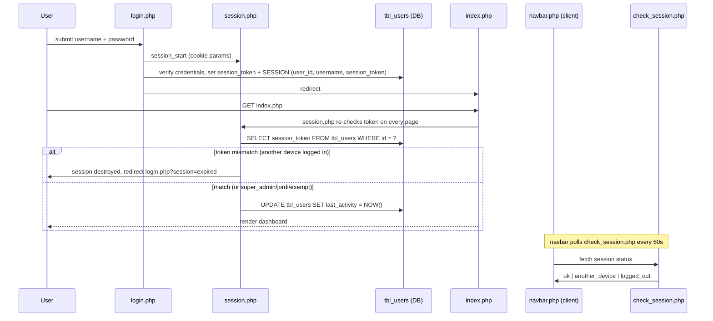
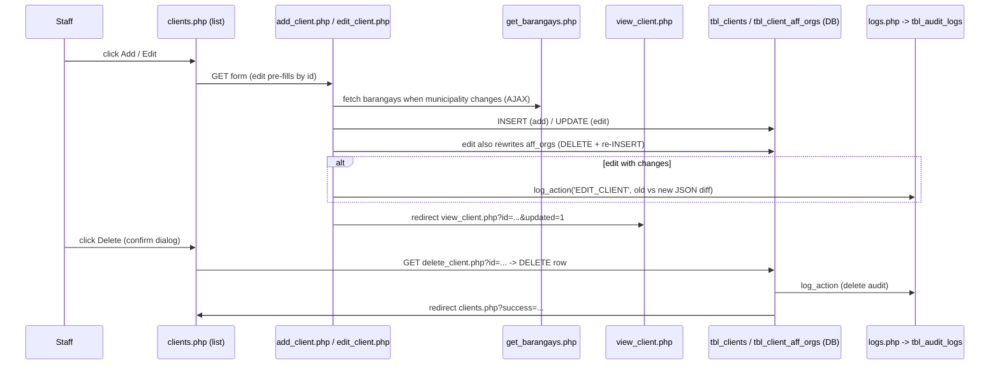
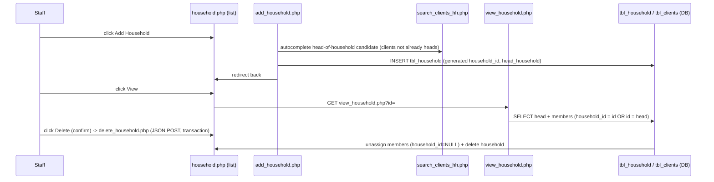
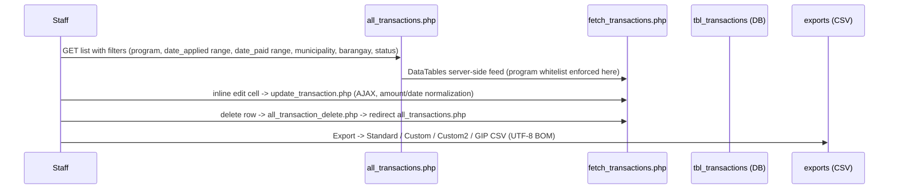
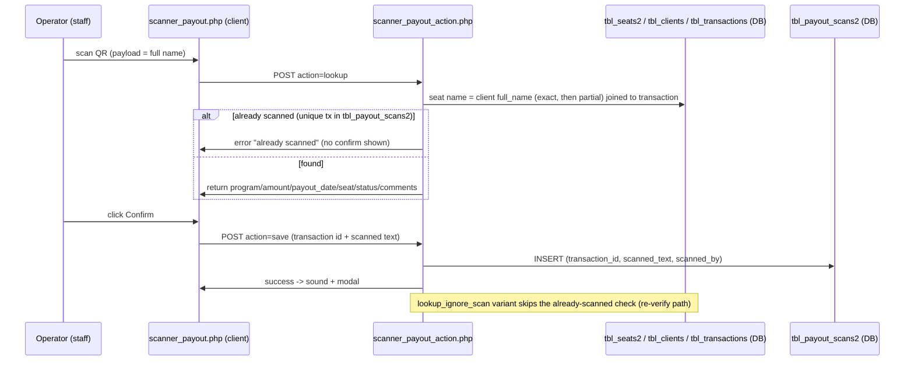
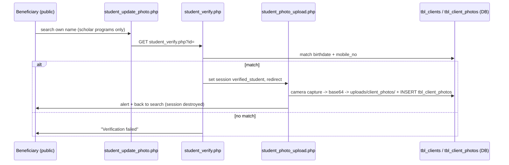

# User Interaction Analysis — v1 2D MIS

> A documentation-only, read-only analysis of how users actually interact with
> the legacy plain-PHP municipal assistance system (v1, `C:\xampp\htdocs\system`).
> It is **input for the v2 rewrite** (Laravel) — it does not propose workflow
> redesigns and does not contain v2 code.
>
> Every claim is grounded in the v1 source. Items marked **[OBSERVED]** were
> read directly from the listed file(s); items marked **[ASSUMED]** could not be
> fully confirmed from source alone and are flagged for verification before the
> corresponding v2 port.

---

## 1. Purpose, Scope, and Method

### 1.1 Purpose
This document records the complete user interaction surface of v1 so the v2
rewrite can reproduce the same workflows with the same terminology, screen
names, and data outcomes (v2 objective **O5 — same workflow for end users**,
see `docs/VISION_AND_SCOPE.md`).

### 1.2 Scope
- Every v1 screen a user can reach: staff screens (clients, households,
  transactions, scanners, payout lists, scholarship, reports, admin/audit) and
  public self-service screens (QR viewer, student photo update, grantee
  self-update, unpaid verification).
- The session/authorization layer that surrounds all of it.
- The data writes each flow makes (tables, audit rows, files).

### 1.3 Method
- All v1 files in `C:\xampp\htdocs\system` were enumerated and read.
- Behavior is described from the PHP source (POST targets, redirects, queries,
  audit calls), not from runtime observation.
- Cross-referenced against `system/doc/v1/*` (existing v1 docs) and
  `docs/*` in this repo (v2 planning).

### 1.4 Labeling convention
| Label | Meaning |
|---|---|
| **[OBSERVED]** | Behavior confirmed by reading the file(s) cited. |
| **[ASSUMED]** | Behavior inferred (common pattern, or a file could not be fully read). Confirm before porting. |

---

## 2. Actors and Roles

| Actor | Who it is | How v1 identifies them | Access surface |
|---|---|---|---|
| **Super administrator** | `super_admin`, `god_admin`, `jordi`, or `user_id == 1` | Hard-coded usernames + id (see §4) | All pages, all scanners, admin screens |
| **Staff user (limited)** | Any other logged-in `tbl_users` row | `tbl_permissions` row (`user_id`, `page_name`, `can_access`) | Only the pages granted to them |
| **Program-restricted staff** | Any staff user | `tbl_program_permissions` row (`user_id`, `program_name`) | Only transaction entries for allowed programs — but only in `add_transaction.php` / `edit_transaction.php` |
| **Beneficiary / grantee (public)** | A person in `tbl_clients` | No login; identity proven by name search + municipality / birthdate + mobile | Public self-service pages (§9) |

**Key structural fact [OBSERVED]:** v1 has **two overlapping access models**
— hard-coded usernames/ids in `restriction.php` **and** DB permission rows.
This is the acknowledged v1 weakness (v2 objective **O4**) that the single
`AccessControlService` replaces.

---

## 3. Authentication, Session Lifecycle, and Navigation Skeleton

### 3.1 Login flow [OBSERVED]
Files: `login.php`, `session.php`, `logout.php`, `check_session.php`, `navbar.php`.



Session facts [OBSERVED]:
- `session.php`: default cookie lifetime **1 day**; `super_admin` / `jordi`
  (and any session that was created by one of them) get **10 years**.
- Cookies: `httponly`, `samesite=Lax`, `secure` only when HTTPS.
- **Single-device login:** for everyone except `super_admin`, `jordi`, and users
  with a `tbl_multi_device_exemptions` row, `session.php` compares
  `$_SESSION['session_token']` to `tbl_users.session_token` on **every page
  load**. A mismatch destroys the session and redirects to
  `login.php?session=expired`. This is the v1 equivalent of v2's
  `EnsureSingleDevice` middleware (ADR-002).
- `last_activity` is refreshed on every page load for logged-in users.
- `login.php` redirects to `index.php` if already logged in.
- `logout.php` NULLs `session_token`, destroys the session, redirects to `login.php`.

`navbar.php` renders the username dropdown (with logout) and runs a
`checkSession()` poll every 60 seconds against `check_session.php`, which
returns `ok` / `another_device` / `logged_out`. On anything but `ok` the client
redirects to `login.php` with an appropriate message — so a force-logout
(`force_logout.php`, admin screen) kicks the user's browser within 60s.

### 3.2 Navigation skeleton [OBSERVED]
Files: `index.php`, `navbar.php`, `sidebar.php`, `sidebar.js`, `sidebar.css`.

- `index.php` is the post-login dashboard: navbar + sidebar + a welcome card +
  **13 scanner entry cards** (CEAP, CEDSSG, TUPAD, TODA, NEW SCHOLARS, NEW CEAP,
  OTCES, OTEA, NEW CEDSSG, PAYOUT, UNPAID PAYOUT, ONGOING SCHOLARS, CEDSSG
  UPDATE). These cards duplicate the sidebar links — a navigation-maintenance
  burden v2's single shared layout avoids.
- `sidebar.php` renders 12 main links and adds **7 admin-only links** when the
  session username is one of `super_admin` / `god_admin` / `jordi`
  (this is where "admin-only" lives in the UI).
- `sidebar.js` handles desktop collapse / mobile slide-in overlay.

---

## 4. Authorization and Permissions (Page + Program)

### 4.1 Page permission check [OBSERVED]
File: `restriction.php`. Included at the top of restricted pages.

```
if no session user            -> redirect login.php
if user_id == 1               -> allow (return)
if username in {super_admin, god_admin, jordi} -> allow (return)
else SELECT can_access FROM tbl_permissions WHERE user_id=? AND page_name=basename(PHP_SELF)
     if falsy -> alert('Access Denied') + redirect index.php
```

So **every restricted page** is gated per-file by its basename against
`tbl_permissions` (column `page_name` = e.g. `clients.php`). `manage_permissions.php`
edits this matrix in the UI.

**Notable v1 gaps [OBSERVED]:**
- **Scanner action endpoints do NOT include `restriction.php`.** Every
  `scanner_*_action.php` only checks `isset($_SESSION['user_id'])`. Some scanner
  **pages** also skip `restriction.php` (e.g. `scanner_generic.php`,
  `scanner_payout_unpaid.php`). Anyone with a session can hit these endpoints
  regardless of page grants.
- **Program permissions are enforced in exactly two places** —
  `add_transaction.php` and `edit_transaction.php` (`die("Unauthorized program
  selection")` when the chosen program is outside `tbl_program_permissions`,
  and the program dropdown is filtered). No scanner action script consults
  `tbl_program_permissions`.

### 4.2 Program permission model [OBSERVED]
Files: `manage_program_permissions.php`, `fetch_transactions.php`.

- `tbl_program_permissions(user_id, program_name)` rows grant programs. The
  program catalog in v1 (from the management screen) is: **AICS, AKAP, MAIP,
  TUPAD, CEDSSG, CEAP, CEAP_NEW, OTCES, OTEA, CEDSSG_NEW, COFFEE GROWERS,
  PUSO TI KABABAIHAN, PUSO TI AGTUTUBO, PUSO TI MANNALON, TESDA, GIP, TODA**.
- `fetch_transactions.php` enforces the same whitelist on the server-side
  transactions feed: a user with program rows sees only those programs; a
  requested program outside their set yields an empty result.

### 4.3 Admin-only screens [OBSERVED]
| Screen | Gate |
|---|---|
| `add_user.php` | `SUPER ADMIN ONLY` — username `super_admin` only |
| `register.php` | includes `restriction.php` (redundant duplicate of add-user) |
| `manage_multi_device_exemptions.php` | `super_admin` + `jordi` only |
| `manage_php.php` | `super_admin` only (file-manager-like admin page; **excluded from v2**, blueprint A10) |
| `manage_permissions.php`, `manage_program_permissions.php`, `audit_logs.php`, `currently_logged_users.php` | reachable via admin-only sidebar links; the top admin users bypass page checks |
| `preview_duplicates.php`, `delete_duplicates.php` | inline `in_array(username, ['super_admin','jordi'])` |

---

## 5. Client Lifecycle Flows

### 5.1 Client list [OBSERVED]
Files: `clients.php`, `fetch_clients.php`.

- `clients.php` renders a server-side DataTable with a **municipality filter**
  (and barangay filter in the feed) and per-row action buttons
  (view 👁 / edit ✎ / delete 🗑).
- `fetch_clients.php` is the DataTables feed: word-split **AND** search across
  names, mobile, voter id, precinct, occupation, municipality, barangay; a
  smart ranking `CASE` when searching; ordering/paging from DataTables. All
  output is `htmlspecialchars`-escaped. A commented-out file-cache block exists
  but is disabled.

### 5.2 Add / Edit / View / Delete client



Details [OBSERVED]:
- `add_client.php` is a ~25 KB form (names, geo cascade, household picker,
  contact, birthdate → auto age + category, PWD/IP/IP-group, occupation,
  income, aff orgs, precinct/voter id) → POST insert → redirect
  `view_client.php?id=...`.
- `edit_client.php` is the same form pre-filled; recomputes `full_name` and
  `match_name`; **rewrites `tbl_client_aff_orgs`** (delete + re-insert, max 5);
  and writes an **`EDIT_CLIENT` audit row with old/new JSON diffs** when
  anything changed. Region/Province are fixed to `Region I` / `Ilocos Sur`.
- `view_client.php` (1,853 lines) is the client profile page: personal info,
  photo, family members (with **relationship + inverse relationship** helpers),
  affiliated orgs, scholarship collapse section, GIP details, and an embedded
  transactions list (`transaction_table.php`).
- `delete_client.php` deletes the `tbl_clients` row, writes an audit row, and
  redirects back to the list with a success message. **[OBSERVED]** it is a
  GET endpoint with a client-side confirm — no CSRF token, no transaction
  guard on related rows (family/photos/transactions), so referential cleanup is
  whatever the schema FK rules allow.

### 5.3 Family members [OBSERVED]
Files: `view_client.php`, `add_family_member.php`, `search_clients.php`.

- Family links live in `tbl_family_members(client_id, relative_id, relationship)`
  with inverse rows maintained manually.
- Adding a member searches clients (`search_clients.php` excludes the parent
  and already-linked relatives), then writes **both directions** in one
  transaction (`update_relationship` POST inside `view_client.php`).
- **No audit row** is written for family relationship changes **[OBSERVED]**.
- Relationships are resolved through `get_relationship()` /
  `get_inverse_relationship()` helper functions in `view_client.php`.

### 5.4 Client photo [OBSERVED]
Files: `client_photo.php`, `save_client_photo.php`.

- Capture from **camera (base64 JPEG)** or **file upload**.
- Stored under `uploads/client_photos/` with a row in `tbl_client_photos`
  (`client_id`, `photo_path`, `source` = `UPLOAD`/`CAMERA`, timestamps).
- The public student flow (see §9.2) writes the same table.

### 5.5 Duplicate detection & bulk delete [OBSERVED]
Files: `preview_duplicates.php`, `fetch_duplicates.php`, `delete_duplicates.php`.

- Duplicates are computed by grouping `tbl_clients` on
  `lastname + firstname + middlename + city_municipality` with `HAVING COUNT(*) > 1`
  — a deterministic exact-key match (no fuzzy scoring).
- `preview_duplicates.php` lets `super_admin`/`jordi` filter by municipality /
  barangay, tick checkboxes, and POST to `delete_duplicates.php`, which
  `DELETE ... WHERE id IN (...)` and redirects with a count message.
- **No audit rows** for duplicate deletion [OBSERVED].

### 5.6 GIP profile (client detail) [OBSERVED]
File: `save_gip.php`.

- Saved from the client profile page; writes `tbl_gip_info`-style fields
  (govt ID, insurance/emergency contact, education history, work experience,
  skills, achievements) **with an audit row** via `logs.php`.

---

## 6. Household Flows



Details [OBSERVED]:
- `add_household.php` generates the public `household_id` code from
  `tbl_municipalities.code` (e.g. `CND-00001`) with a fallback to a 3-letter
  prefix.
- `view_household.php` shows the head (badge) and members sorted with the head
  first; each member links to `view_client.php`.
- `delete_household.php` is a **transaction-guarded** JSON POST that unassigns
  member `household_id` fields before deleting the household row.
- Client-side member assignment is also exposed in `edit_client.php` via a
  household search picker (`search_households.php`).
- `fetch_households.php` computes `member_count` as clients whose
  `household_id = h.id` **plus one if the head client is not already in that
  set** — the head is always counted as a member.

---

## 7. Transaction Flows

### 7.1 Add transaction (from client profile)
Files: `add_transaction.php`, `transaction_table.php`.

- `add_transaction.php` **requires `?client_id=`** — transactions are always
  attached to a client. It offers a **beneficiary/patient picker**:
  `self` (the client), `custom` (free-text name), or `existing` (search a
  different client).
- The program dropdown is filtered by `tbl_program_permissions`; selecting an
  unauthorized program is rejected server-side.
- Statuses include `PENDING PAYOUT` and `PAID`; fields include date_applied,
  type, remarks, comments, suggested_amount, amount_paid, payout_date,
  date_paid, GWA, units.
- The in-client transaction list (`transaction_table.php`) shows the client's
  transactions with a **+ Add Transaction** button.

### 7.2 All-transactions screen (full list)
Files: `all_transactions.php`, `fetch_transactions.php`,
`update_transaction.php`, `all_transaction_edit.php`, `all_transaction_delete.php`.



Details [OBSERVED]:
- `all_transactions.php` is a **GET-only** page; DataTables is mostly
  client-side, but `fetch_transactions.php` provides the server-side feed and
  the **Custom CSV export** (the standard/custom2/GIP exports are separate).
- `fetch_transactions.php` enforces the program whitelist, joins client +
  barangay + municipality, converts `created_at` from UTC to `Asia/Manila`,
  and streams the Custom CSV with a UTF-8 BOM when `?export_custom=csv`.
- `update_transaction.php` is the AJAX inline-edit endpoint (normalizes amount
  and date fields).
- Exports are named `transactions_custom_YYYYMMDD.csv` etc. — the P3 v2 exports
  already mirror this set (Standard / Custom / Custom2 / GIP).

### 7.3 Delete transactions [OBSERVED]
- `delete_transaction.php` (from the client page) redirects back to
  `view_client.php?id=...` with a message.
- `all_transaction_delete.php` redirects back to `all_transactions.php`.
- Both are GET endpoints with client-side confirmation; audit behavior was not
  visible in the redirect-only stubs reviewed.

---

## 8. QR Scanners and Payout Flows

### 8.1 Shared scanner mechanics [OBSERVED]
All 13 scanners + the generic scanner share one client-side pattern:
- `html5-qrcode` from unpkg + Bootstrap 5.3.0 CDN, a `#reader` div, a result
  area, a Bootstrap **message modal**, and two sounds (`sounds/success.mp3`,
  `sounds/not_found.mp3`).
- The QR payload is the client's **`full_name` string** (not an id). Lookups
  match it case-insensitively against `tbl_clients.full_name` (some programs
  additionally join `tbl_seats2` or `tbl_scholar_info`).
- Scanned flows are two-phase: **`lookup`** (find the person, show details +
  Confirm button) then **`save`** (write the attendance/transaction).

### 8.2 Generic scanner (transaction creation) [OBSERVED]
Files: `scanner_generic.php`, `scanner_generic_action.php`.

- After a successful lookup the operator fills a **full transaction form**
  (program dropdown, patient option self/custom/existing, date, type, status,
  amounts, GWA/units) and saves → `INSERT INTO tbl_transactions`.
- **No audit row** for the generic save [OBSERVED].

### 8.3 Program scanners (CEAP, CEAP_NEW, CEDSSG, …) [OBSERVED]
Files: `scanner_ceap.php` + `scanner_ceap_action.php` (representative; the
others follow the same shape).

- `scanner_ceap_action.php` `lookup`: exact `full_name` match
  (`TRIM(full_name) COLLATE utf8mb4_general_ci = :scanned`).
- `save`: duplicate-guard (counts existing `CEAP` transactions with the same
  semester remark), then inserts a `tbl_transactions` row
  (`type=SCHOLARSHIP`, `status=PENDING PAYOUT`,
  `remarks='1ST SEM SY2025-2026 DOCS SUBMITTED'`, `suggested_amount=5000`),
  then writes an **audit row `SCAN-CEAP`** with the new row's JSON.
- The other program scanners (CEDSSG, NEW variants, OTCES, OTEA, TUPAD, TODA,
  new/ongoing scholars, CEDSSG update) use the same two-phase pattern; a few
  use a scalar `qrbox: 250` and some derive the program from `tbl_exam` /
  `tbl_results` / the latest transaction.

### 8.4 Payout scanner (attendance) [OBSERVED]
Files: `scanner_payout.php`, `scanner_payout_action.php`.



Details [OBSERVED]:
- Program whitelist: `CEAP, CEDSSG, CEAP_NEW, CEDSSG_NEW, OTEA, OTCES`.
- Matching: exact `tbl_seats2.name = tbl_clients.full_name`, then a partial
  fallback; joined to the client's latest transaction in an allowed program.
- `save` inserts into `tbl_payout_scans2`; the DB `UNIQUE(transaction_id)`
  constraint plus a duplicate-key (`23000`) handler are the anti-double-scan
  belt. **No audit row** on payout scans [OBSERVED] (matches v1 and the P4
  parity note in `docs/implementation/P5_PAYOUT.md` §3).

### 8.5 Unpaid payout scanner [OBSERVED]
Files: `scanner_payout_unpaid.php`, `scanner_payout_unpaid_action.php`.

- Same two-phase pattern but program whitelist is only
  `CEAP, CEAP_NEW, OTEA, OTCES`, lookup is a **partial `patient_name` LIKE**
  against `tbl_transactions`, and `save` writes
  `tbl_payout_scans_unpaid` instead of `tbl_payout_scans2`.

### 8.6 Payout attendance list screens [OBSERVED]
Files: `scanned_payouts.php`, `scanned_payouts2.php`, `scanned_payouts_unpaid.php`
+ `fetch_scanned_payouts*.php`.

- Three near-identical DataTable screens (backing tables `tbl_payout_scans`,
  `tbl_payout_scans2`, `tbl_payout_scans_unpaid`), each with municipality
  filter, and for the unpaid variant also program + scanned-date-range filters.
- `scanned_payouts_unpaid.php` additionally has a **View details modal** and a
  **Delete row** action (POST to the same feed with `delete_id`), plus an
  **Export CSV** button.
- **[OBSERVED] gap:** the Export button targets `export_scanned_payouts_unpaid.php`,
  which **does not exist** in the v1 directory — the button is dead. The
  corresponding fetch file has no export branch. (v2 should implement the
  export deliberately.)

### 8.7 Unpaid verification (staff + public) [OBSERVED]
Files: `unpaid_verifications.php`, `fetch_unpaid_verifications.php`,
`export_unpaid_verifications.php`, `disabled_unpaid.php`,
`search_unpaid_grantee.php`, `unpaid_save.php`.

- Staff screen lists `tbl_unpaid_verifications` rows (client, municipality,
  proxy flags/identity, created_at) with CSV export (UTF-8 BOM).
- The **public** side (`disabled_unpaid.php`) lets a grantee with a
  `PENDING PAYOUT` transaction in an allowed program verify their municipality
  and confirm attendance as **self** or via **proxy** (full proxy identity
  form). `unpaid_save.php` rejects duplicate submissions for the same client.
- `search_unpaid_grantee.php` restricts autocomplete to clients who have a
  `PENDING PAYOUT` transaction in the allowed programs.
- Proxy data is stored as a **denormalized snapshot** in the same row (v1
  design intent; keep in v2 per `docs/implementation/P5_PAYOUT.md` §2.3).

---

## 9. Public Self-Service, Scholarship, Reports, and Admin/Audit Flows

### 9.1 Scholarship management & reporting [OBSERVED]
Files: `scholars.php`, `fetch_scholars.php`, `save_scholarship.php`,
`scholarship_reports.php`, `fetch_scholarship_reports.php`,
`export_scholarship_reports.php`, `update_client_id.php`.

- `scholars.php` is a DataTable of `tbl_scholar_info` (name, program, school,
  year, landbank no); `fetch_scholars.php` joins `tbl_exam` for barangay/town
  via a name match.
- `save_scholarship.php` **upserts** `tbl_scholar_info` for `(client_id,
  program)` from the client page's scholarship collapse; **no audit row**.
- `update_client_id.php` relinks a scholar row to a different client.
- Reports + CSV export (UTF-8 BOM) mirror the transactions export pattern.

### 9.2 Public: student photo update [OBSERVED]
Files: `student_update_photo.php`, `student_verify.php`, `student_photo_upload.php`.



### 9.3 Public: QR code viewer [OBSERVED]
File: `view_qrcode.php`.

- Search name → verify municipality against `tbl_clients` → generate QR via the
  external **api.qrserver.com** service encoding `LASTNAME, FIRSTNAME
  MIDDLENAME` (the exact `full_name` form the scanners match). Download link
  provided. Note: this relies on an **external third-party API** and a name-only
  payload (no id), which is why the scanners must keep matching on `full_name`.

### 9.4 Public: grantee self-update [OBSERVED]
Files: `disabled_update_grantee.php`, `search_grantee.php`, `save_grantee_update.php`,
`update_logs.php`, `fetch_update_logs.php`.

- `disabled_update_grantee.php` (public, standalone) lets a grantee in one of
  the six scholar programs search themselves, load their data, and update
  contact/school details.
- `save_grantee_update.php` is transactional: updates the client (name and
  geography are **preserved from the DB** — only certain fields are editable),
  upserts `tbl_scholar_info`, and writes a **`tbl_update_logs` row with the
  requester IP** (`action = 'Grantee self-updated their information.'`).
- `update_logs.php` / `fetch_update_logs.php` render the module-specific update
  history with date filters and UTC→`Asia/Manila` display.

### 9.5 Admin & audit [OBSERVED]
Files: `audit_logs.php`, `fetch_logs.php`, `fetch_leaderboard.php`,
`currently_logged_users.php`, `fetch_online_users.php`, `force_logout.php`,
`manage_permissions.php`, `manage_program_permissions.php`,
`manage_multi_device_exemptions.php`, `add_user.php`, `register.php`,
`manage_php.php`.

- `audit_logs.php` reads `tbl_audit_logs` (via `fetch_logs.php`) with a
  `target_table` tab switcher restricted to `tbl_clients`, `tbl_transactions`,
  `tbl_cedssg`, actor/action filter dropdowns, a 10k-row cap, and UTC→PHT time
  conversion.
- `fetch_leaderboard.php` aggregates audit rows into an action count **per
  username** for the same three tables.
- `currently_logged_users.php` + `fetch_online_users.php` list users with a
  non-null `session_token` and `last_activity` within 20 minutes, excluding
  `jordi`/`super_admin`; **End Session** → `force_logout.php` (POST, NULLs the
  token). The navbar poll (§3.1) evicts them client-side within ~60s.
- User creation is split across two files (`add_user.php` [super_admin only],
  `register.php`) with **no CSRF tokens** and plain-PHP sessions.
- `manage_php.php` is a super-admin file-manager-like page — explicitly
  **excluded from the v2 rewrite** (blueprint A10 / `docs/implementation/P7_ADMINISTRATION.md` §5).

### 9.6 Cross-cutting observations for the v2 port

Security/robustness gaps observed in v1 (v2 objectives **O3/O4**, ADR-003,
ADR-009):

| # | v1 fact | v2 impact |
|---|---|---|
| 1 | Action endpoints (`scanner_*_action.php`) check only `user_id`, never page grants | All v2 mutation routes must go through `page:` middleware; `ScanService` methods are route-agnostic |
| 2 | Program permissions enforced only in `add_transaction` / `edit_transaction` | v2 must decide a single enforcement point (Gate + service-level check) |
| 3 | GET endpoints mutate state (`delete_client.php`, `delete_transaction.php`, `delete_duplicates.php`) | v2 should use POST/DELETE with CSRF; document the parity break |
| 4 | Family-relationship and duplicate-deletion writes have **no audit rows** | Decide whether to keep parity or add audit (v2 `AuditService` already records P2/P3 actions) |
| 5 | `export_scanned_payouts_unpaid.php` referenced but **missing** | P5 must implement the export or drop the button |
| 6 | Hard-coded usernames/ids in `restriction.php`, `sidebar.php`, `preview_duplicates.php`, `delete_duplicates.php`, `audit_logs.php`, `fetch_online_users.php`, `session.php` | All replaced by the single `AccessControlService` (super-admin = `page_name='*'` row) |
| 7 | Public flows use name-only verification (QR payload = `full_name`; verify by municipality or birthdate+mobile) | Preserve the exact payload/verify semantics or an ADR is needed (P6 §5.7) |
| 8 | `tbl_update_logs` is a module-specific audit with IP — separate from `tbl_audit_logs` | P6 keeps the two-log distinction |

---

## File Reference Index

Auth/session: `session.php`, `login.php`, `logout.php`, `check_session.php`,
`navbar.php`, `sidebar.php`, `sidebar.js`, `index.php`.
Permissions/admin: `restriction.php`, `manage_permissions.php`,
`manage_program_permissions.php`, `manage_multi_device_exemptions.php`,
`currently_logged_users.php`, `fetch_online_users.php`, `force_logout.php`,
`audit_logs.php`, `fetch_logs.php`, `fetch_leaderboard.php`, `add_user.php`,
`register.php`, `manage_php.php`.
Clients: `clients.php`, `fetch_clients.php`, `add_client.php`,
`edit_client.php`, `view_client.php`, `delete_client.php`,
`add_family_member.php`, `search_clients.php`, `client_photo.php`,
`save_client_photo.php`, `verify_mobile.php`, `save_gip.php`,
`preview_duplicates.php`, `fetch_duplicates.php`, `delete_duplicates.php`.
Households: `household.php`, `fetch_households.php`, `add_household.php`,
`view_household.php`, `delete_household.php`, `get_household.php`,
`get_client_hh.php`, `search_households.php`, `search_clients_hh.php`.
Transactions: `all_transactions.php`, `fetch_transactions.php`,
`add_transaction.php`, `edit_transaction.php`, `all_transaction_edit.php`,
`update_transaction.php`, `delete_transaction.php`,
`all_transaction_delete.php`, `view_transaction.php`, `transaction_table.php`.
Scanners: `scanner_generic.php`, `scanner_generic_action.php`,
`scanner_ceap.php`/`scanner_ceap_new.php`/`scanner_cedssg.php`/
`scanner_cedssg_new.php`/`scanner_cedssg_update.php`/`scanner_tupad.php`/
`scanner_toda.php`/`scanner_otces.php`/`scanner_otea.php`/
`scanner_new_scholars.php`/`scanner_ongoing_scholars.php`/`scanner_payout.php`/
`scanner_payout_unpaid.php` (+ their `*_action.php`).
Payout lists: `scanned_payouts.php`, `scanned_payouts2.php`,
`scanned_payouts_unpaid.php`, `fetch_scanned_payouts.php`,
`fetch_scanned_payouts2.php`, `fetch_scanned_payouts_unpaid.php`,
`unpaid_verifications.php`, `fetch_unpaid_verifications.php`,
`export_unpaid_verifications.php`, `disabled_unpaid.php`,
`search_unpaid_grantee.php`, `unpaid_save.php`.
Scholars/reports: `scholars.php`, `fetch_scholars.php`,
`save_scholarship.php`, `scholarship_reports.php`,
`fetch_scholarship_reports.php`, `export_scholarship_reports.php`,
`update_client_id.php`, `save_gip.php`, `save_grantee_update.php`,
`disabled_update_grantee.php`, `update_logs.php`, `fetch_update_logs.php`,
`view_qrcode.php`.
Public self-service: `view_qrcode.php`, `student_update_photo.php`,
`student_verify.php`, `student_photo_upload.php`, `search_grantee.php`,
`search_unpaid_grantee.php`, `disabled_update_grantee.php`, `disabled_unpaid.php`.
Shared infra: `db_connect.php`, `logs.php`, `favicon.php`, `get_barangays.php`.

## Planned / open verification items
- Confirm whether `disabled_unpaid.php` / `disabled_update_grantee.php`
  semantics are delete or disable before porting (P5/P6 both flag this).
- Confirm the exact `action` strings the v1 scanner/payout writes use before
  inventing v2 audit names (P5 §4.3).
- Decide the fate of the dead `export_scanned_payouts_unpaid.php` link.
- Decide whether to keep v1 parity (no audit on family/duplicate/scanner-save
  writes) or add audit in v2 (requires an ADR).
